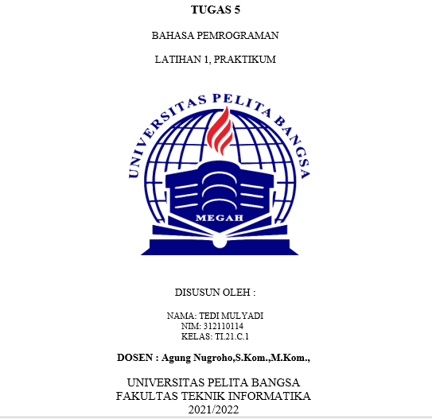
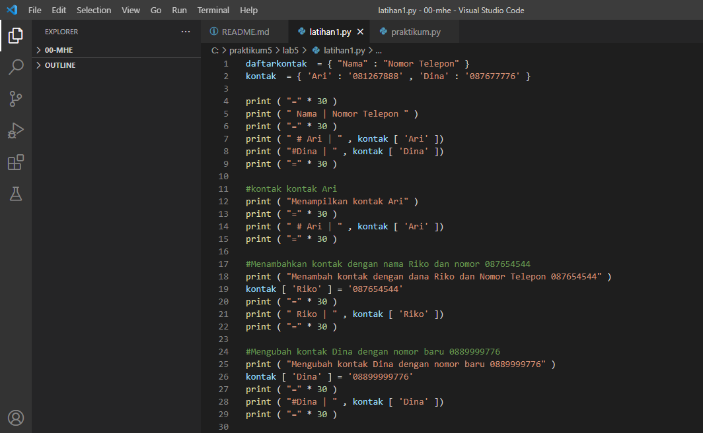
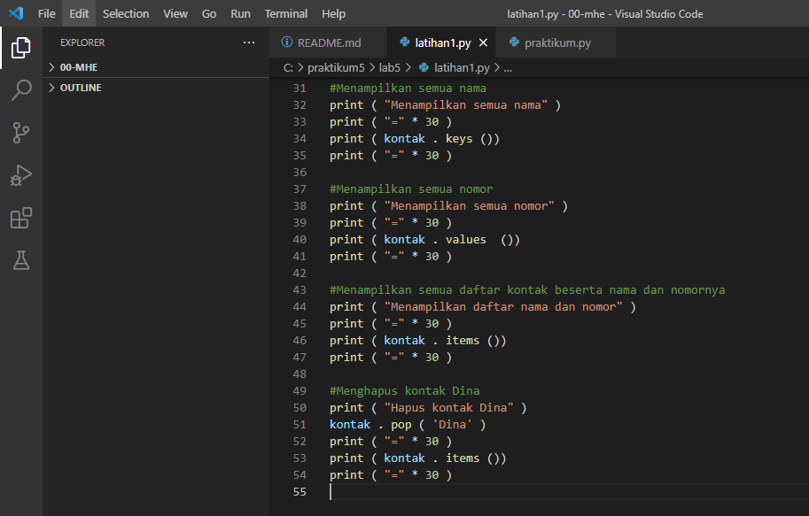
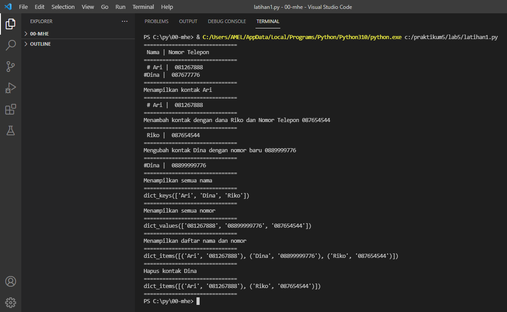

# labs5

# Latihan1.py

Membuat dictionary daftar kontak

# PROGRAMNYA

Penjelasan programnya sebagai berikut :

# Dibawah ini adalah untuk menampung data dari kamus
daftarkontak = { "Nama" : "Nomor Telepon" } kontak = { 'Ari' : '081267888' , 'Dina' : '087677776' }

# Sedangkan kode di bawah adalah untuk mengakses atau menampilkan kontak yang telah ditampung dalam kamus data tersebut
print ( "=" * 30 ) print ( " Nama | Nomor Telepon " ) print ( "=" * 30 ) print ( " # Ari | " , kontak [ 'Ari' ]) print ( " # Dina | " , kontak [ 'Dina' ]) print ( "=" * 30 )

# ini adalah untuk menampilkan salah satu dari daftar kontak yang ada, di bawah yang akan ditampilkan adalah daftar kontak Ari
print ( "Menampilkan kontak Ari" ) print ( "=" * 30 ) print ( " # Ari | " , kontak [ 'Ari' ]) print ( "=" * 30 )

# ini untuk menambahkan kontak dengan nama Riko dan nomor 087654544
print ( "Menambah kontak dengan dana Riko dan Nomor Telepon 087654544" ) kontak [ 'Riko' ] = '087654544' print ( "=" * 30 ) print ( " Riko | " , kontak [ 'Riko' ]) print ( "= " * 30 )

# ini untuk mengubah kontak Dina dengan nomor baru 0889999776
print ( "Mengubah kontak Dina dengan nomor baru 0889999776" ) kontak [ 'Dina' ] = '08899999776' print ( "=" * 30 ) print ( " # Dina | " , kontak [ 'Dina' ]) print ( "=" * 30 )

# ini untuk menampilkan semua nama yang ada dalam daftar kontak
mencetak ( "Menampilkan SEMUA nāma" ) print ( "=" * 30 ) cetak ( Kontak . tombol ()) print ( "=" * 30 )

# ini untuk menampilkan semua nomor yang ada dalam daftar kontak
mencetak ( "Menampilkan SEMUA nomor" ) print ( "=" * 30 ) cetak ( Kontak . nilai-nilai ()) print ( "=" * 30 )
# ini untuk menampilkan semua daftar kontak beserta nama dan nomornya
print ( "Menampilkan daftar nama dan nomor" ) print ( "=" * 30 ) print ( kontak . item ()) print ( "=" * 30 )
# ini untuk menghapus kontak Dina yang tersimpan dalam daftar kontak
print ( "Hapus kontak Dina" ) kontak . pop ( 'Dina' ) print ( "=" * 30 ) print ( kontak . item ()) print ( "=" * 30 )

# OUTPUT PEROGRAMNYA

