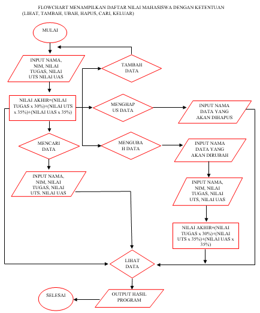
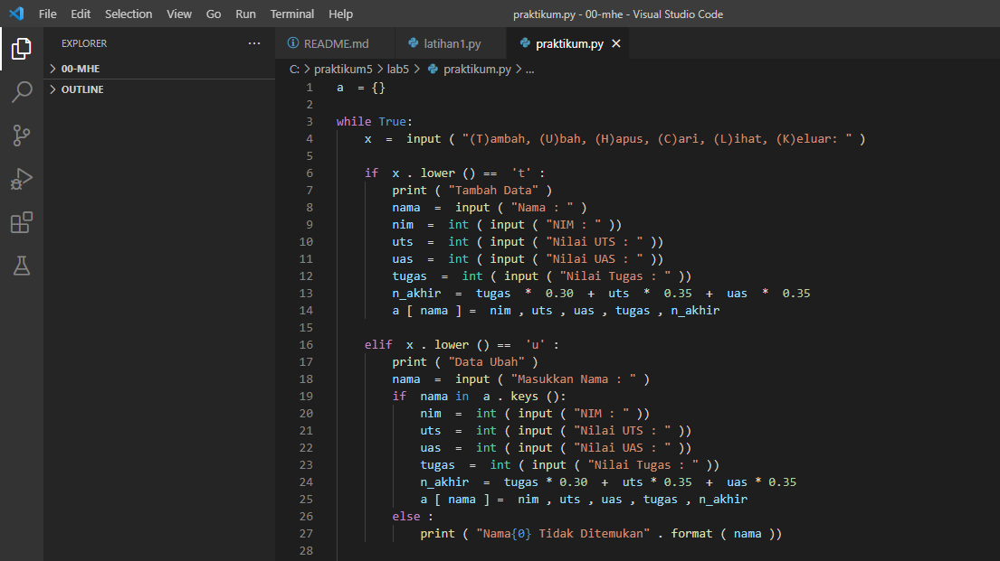
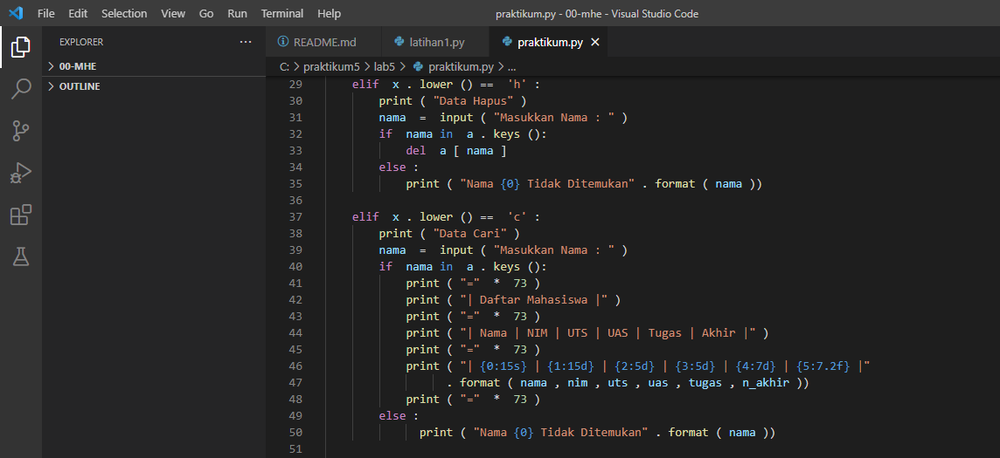
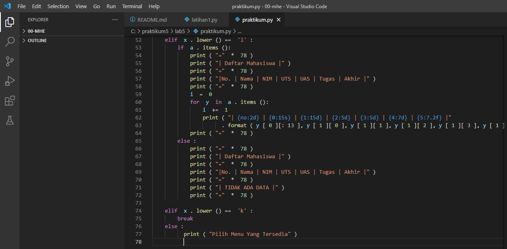

# labs5

# Latihan1.py

Membuat dictionary daftar kontak

# PROGRAMNYA

Penjelasan programnya sebagai berikut :

# Dibawah ini adalah untuk menampung data dari kamus
daftarkontak = { "Nama" : "Nomor Telepon" } kontak = { 'Ari' : '081267888' , 'Dina' : '087677776' }

# Sedangkan kode di bawah adalah untuk mengakses atau menampilkan kontak yang telah ditampung dalam kamus data tersebut
print ( "=" * 30 ) print ( " Nama | Nomor Telepon " ) print ( "=" * 30 ) print ( " # Ari | " , kontak [ 'Ari' ]) print ( " # Dina | " , kontak [ 'Dina' ]) print ( "=" * 30 )

# ini adalah untuk menampilkan salah satu dari daftar kontak yang ada, di bawah yang akan ditampilkan adalah daftar kontak Ari
print ( "Menampilkan kontak Ari" ) print ( "=" * 30 ) print ( " # Ari | " , kontak [ 'Ari' ]) print ( "=" * 30 )

# ini untuk menambahkan kontak dengan nama Riko dan nomor 087654544
print ( "Menambah kontak dengan dana Riko dan Nomor Telepon 087654544" ) kontak [ 'Riko' ] = '087654544' print ( "=" * 30 ) print ( " Riko | " , kontak [ 'Riko' ]) print ( "= " * 30 )

# ini untuk mengubah kontak Dina dengan nomor baru 0889999776
print ( "Mengubah kontak Dina dengan nomor baru 0889999776" ) kontak [ 'Dina' ] = '08899999776' print ( "=" * 30 ) print ( " # Dina | " , kontak [ 'Dina' ]) print ( "=" * 30 )

# ini untuk menampilkan semua nama yang ada dalam daftar kontak
mencetak ( "Menampilkan SEMUA nāma" ) print ( "=" * 30 ) cetak ( Kontak . tombol ()) print ( "=" * 30 )

# ini untuk menampilkan semua nomor yang ada dalam daftar kontak
mencetak ( "Menampilkan SEMUA nomor" ) print ( "=" * 30 ) cetak ( Kontak . nilai-nilai ()) print ( "=" * 30 )
# ini untuk menampilkan semua daftar kontak beserta nama dan nomornya
print ( "Menampilkan daftar nama dan nomor" ) print ( "=" * 30 ) print ( kontak . item ()) print ( "=" * 30 )
# ini untuk menghapus kontak Dina yang tersimpan dalam daftar kontak
print ( "Hapus kontak Dina" ) kontak . pop ( 'Dina' ) print ( "=" * 30 ) print ( kontak . item ()) print ( "=" * 30 )

# OUTPUT PEROGRAMNYA

# Tugas praktikum

# Praktikum5.py

Program sederhana yang akan menampilkan daftar nilai mahasiswa, dengan ketentuan tampilkan menu pilihan (Tambah Data, Ubah Data, Hapus Data, Tampilkan Data, Cari Data).

# FLOWCHART MENAMPILKAN DAFTAR NILAI MAHASISWA DENGAN KETENTUAN (LIHAT, TAMBAH, UBAH, HAPUS, CARI, KELUAR)

# Programnya 

# Dengan penjelasan kode sumber sebagai berikut: -Kode di bawah ini untuk membuat kamus kosong, untuk menampung kamus dengan menggunakan tuple
a = {}
# Kode di bawah ini untuk perulangan while, dan juga untuk menginisialkan penambahan menu pilihan Tambah, Ubah, Hapus, Cari, Lihat dan Keluar:
sedangkan Benar :
 x  =  input ( "(T)ambah, (U)bah, (H)apus, (C)ari, (L)ihat, (K)eluar: " )
# Kode di bawah adalah untuk sintaks penambahan data, dengan ketentuan jika kita mengetikkan 't' pada keyboard, maka akan melakukan penambahan data dan ditampung ke dalam kamus 'a' yang telah kita buat, dengan nama sebagai tombol, dan yang lainnya sebagai nilai
jika x . lower () == 't' : print ( "Tambah Data" ) nama = input ( "Nama : " ) nim = int ( input ( "NIM : " )) uts = int ( input ( "Nilai UTS : " )) uas = int ( input ( "Nilai UAS : " )) tugas = int ( input( "Nilai Tugas : " )) n_akhir = tugas * 0.30 + uts * 0.35 + uas * 0.35 a [ nama ] = nim , uts , uas , tugas , n_akhir
# Kode di bawah adalah untuk sintaks mengubah data, dengan ketentuan jika kita mengetikkan 'u' pada keyboard, maka akan melakukan perubahan data yang telah ditampung ke dalam kamus 'a' yang telah kita buat, tetapi data yang dapat diubah hanya data yang berupa nilai nya saja
elif x . rendah () == 'u' : print ( "Ubah Data" ) nama di = masukan ( "Masukkan Nama:" ) jika nama di dalam sebuah . kunci (): nim = int ( masukan ( "NIM : " )) uts = int ( masukan ( "Nilai UTS : " )) uas = int ( masukan ("Nilai UAS : " )) tugas = int ( input ( " Nilai Tugas : " )) n_akhir = tugas * 0.30 + uts * 0.35 + uas * 0.35 a [ nama ] = nim , uts , uas , tugas , n_akhir else : print ( "Nama{0} Tidak Ditemukan" . format ( nama ))
# Kode di bawah adalah untuk menghapus data sintaks, dengan ketentuan jika kita mengetikkan 'h' pada keyboard, maka akan menghapus data yang telah kita masukkan ke dalam kamus 'a' yang telah kita buat dengan pernyataan del a[nama]
elif x . menurunkan () == 'h' : print ( "Hapus Data" ) nama di = masukan ( "Masukkan Nama:" ) jika nama di dalam sebuah . keys (): del a [ nama ] else : print ( "Nama {0} Tidak Ditemukan" . format ( nama ))
Kode di bawah adalah untuk sintaks data, dengan ketentuan jika kita mengetikkan 'c' pada keyboard, maka akan melakukan pencarian data dengan memasukkan kunci dari data yang telah kita masukkan ke dalam kamus 'a' yang telah kita buat
elif x . menurunkan () == 'c' : print ( "Cari Data" ) nama di = masukan ( "Masukkan Nama:" ) jika nama di dalam sebuah . kunci (): print ( "=" * 73 ) print ( "| Daftar Mahasiswa |" ) print ( "=" * 73 ) print ("| Nama | NIM | UTS | UAS | Tugas | Akhir |" ) print ( "=" * 73 ) print ( "| {0:15s} | {1:15d} | {2:5d} | {3:5d} | {4:7d} | {5:7.2f} | " . Format ( nama di , nim , UTS , uas , Tugas , n_akhir )) print ( = "" * 73 ) lain : print ( "Nama {0} tidak ditemukan" . Format (nama ))
# Kode di bawah adalah untuk melihat data sintaks, dengan ketentuan jika kita mengetikkan 'l' pada keyboard, maka akan menampilkan keseluruhan dari data yang telah kita masukkan dan ditampung ke dalam kamus 'a' yang telah kita buat
elif x . lower () == 'l' : jika a . item (): print ( "=" * 78 ) print ( "| Daftar Mahasiswa |" ) print ( "=" * 78 ) print ( "|No. | Nama | NIM | UAS | Tugas | Akhir |" ) cetak ( "=" = 0 untuk y di sebuah . item (): i += 1 print ( "| {no:2d} | {0:15s} | {1:15d} | {2:5d} | {3:5d} | {4:7d} | {5 :7.2f} |" . format ( y [ 0 ][: 13 ], y [ 1 ][ 0 ], y [ 1 ][ 1 ], y [ 1 ][ 2 ], y [ 1 ][ 3 ], y [ 1][ 4 ], no = i )) print ( "=" * 78 )
# Kode di bawah adalah untuk menampilkan 'TIDAK ADA DATA', jika kita belum pernah memasukkan data ke dalam kamus 'a'
lain : print ( "=" * 78 ) print ( "| Daftar Mahasiswa |" ) print ( "=" * 78 ) print ( "|No. | Nama | NIM | UTS | Tugas | Akhir |" ) print ( "=" * 78 ) print ( "| TIDAK ADA DATA |") cetak ( "=" * 78 )
# sedangkan kode di bawah adalah untuk sintaks keluar dari program, untuk menghentikan program, dengan ketentuan jika kita mengetikkan 'k' pada keyboard, maka akan keluar dari program tersebut
elif x . lower () == 'k' : break
# Dan kode yang terakhir adalah untuk sintaks jika kita mengetikkan pada keyboard selain dari huruf yang telah didefinisikan di atas seperti 't', 'u', 'h', 'c', 'l', dan 'k', maka akan menampilkan Pilih Menu Yang Tersedia
else :
 print ( "Pilih Menu Yang Tersedia" )

